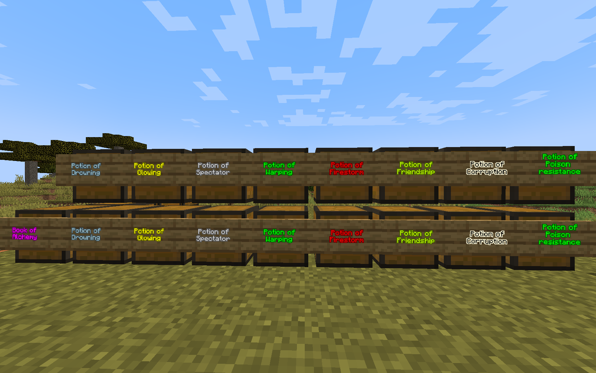

# BetterAlchemy Minecraft Plugin
This Plugin adds additional potions with more complex ingredients

---
## Creating a new potion
1. Place a water cauldron above a heat source (either fire or campfire)
2. Throw the needed ingredients into the cauldron
3. Right-click the cauldron with a stick to create the potion
4. Extract the potions with empty bottles